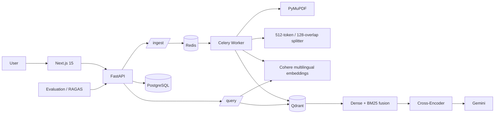

# Shodh

> **Evidence-first multilingual RAG.**

Shodh is a production-minded research assistant for asking grounded questions over multilingual documents. It combines page-aware ingestion, multilingual dense embeddings, BM25 sparse retrieval, hybrid score fusion, local cross-encoder reranking, citation-constrained generation, and RAGAS evaluation.

The project is intentionally built as a conventional software product rather than a demo-shaped AI wrapper. The backend, worker, vector store, relational store, frontend, and evaluation runner have explicit boundaries and testable interfaces.

## Architecture



## Stack

| Layer | Technology |
|---|---|
| API | FastAPI, Python 3.11 |
| Async jobs | Celery + Redis |
| Relational data | PostgreSQL + SQLAlchemy + Alembic |
| Vector search | Qdrant |
| Dense embeddings | Cohere `embed-multilingual-v3.0` |
| Sparse retrieval | Qdrant BM25 / FastEmbed |
| Reranking | `cross-encoder/ms-marco-MiniLM-L-6-v2` |
| Generation | Gemini, configurable model |
| PDF parsing | PyMuPDF |
| Chunking | LangChain recursive splitter + token counting |
| Evaluation | RAGAS |
| Frontend | Next.js 15, React 19, Tailwind, shadcn-style primitives |
| Charts | Recharts |
| CI | GitHub Actions + GHCR |

## Local setup

Requirements: Docker Desktop / Docker Engine with Compose.

```bash
cp .env.example .env
```

For a local setup, set a unique `POSTGRES_PASSWORD` in `.env`. The provider keys are optional for starting the services; ingestion and grounded generation need their respective keys when used.

Optional backend API-key gate:

```dotenv
SHODH_API_KEY=your_local_key
```

Set `NEXT_PUBLIC_REQUIRE_API_KEY=true` to show the key-entry gate in the UI. Keep `SHODH_API_KEY` only in the backend environment; users enter it in the UI and it is sent in the request header. Never put the secret itself in a `NEXT_PUBLIC_*` variable.

Start the stack:

```bash
docker compose up --build
```

Then:

```bash
curl http://localhost:8000/health
curl http://localhost:8000/ready
```

`/health` verifies the API process. `/ready` verifies PostgreSQL, Redis, and Qdrant connectivity.

Open `http://localhost:3000` for the application.

## Services

| Service | Port | Purpose |
|---|---:|---|
| frontend | 3000 | Research UI |
| backend | 8000 | FastAPI API |
| worker | — | Celery ingestion worker |
| qdrant | 6333 | Dense + sparse vector store |
| postgres | 5432 | Metadata and query traces |
| redis | 6379 | Celery broker/result backend |

The worker is intentionally a separate service. The original five-service shape becomes six runtime containers once asynchronous ingestion is implemented. Combining the API and Celery worker would make local development simpler but production isolation worse.

## API

### `GET /health`

Returns `200` when the API process is alive.

### `POST /ingest`

Multipart upload of a PDF. Returns a job ID immediately.

```json
{
  "job_id": "...",
  "doc_id": "...",
  "status": "queued"
}
```

### `GET /ingest/{job_id}`

Returns the ingestion state and chunk count.

### `GET /documents`

Lists indexed documents.

### `DELETE /documents/{doc_id}`

Deletes document metadata and its Qdrant points.

### `POST /query`

```json
{
  "question": "What is the main finding?",
  "doc_id": "...",
  "language": "en"
}
```

The language filter is optional. The response includes the generated answer, page/chunk citations, detected language, latency, and the retrieved context trace used by evaluation.

### `GET /query_logs`

Returns recent query history.

### `POST /evaluate`

Runs the golden-set evaluation and returns the latest JSON report.

## Ingestion details

- PDFs are parsed page by page.
- Chunks target 512 tokens with 128-token overlap.
- A chunk never crosses a page boundary.
- Cohere embeddings are batched in groups of 96.
- Qdrant stores named `dense` and `sparse` vectors.
- Payload includes `page`, `doc_id`, `chunk_id`, `text`, and detected `language`.

## Query details

The retrieval stage gets 20 dense and 20 BM25 candidates. Each score family is normalized independently, then combined as:

`fused = alpha * dense + (1 - alpha) * sparse`

The default `alpha` is 0.7. The fused top 20 are passed to the local cross-encoder, which keeps the top 4 for generation.

The generation prompt requires:

- context-only answers
- explicit `[page X, chunk Y]` citations
- an explicit statement when the answer is absent
- an answer in the same language as the question

## Evaluation

Starter data lives in `evaluation/golden_dataset/questions.json`.

Replace the 15 sample placeholders with real document IDs, expected answers, and relevant chunk IDs. Then run:

```bash
python evaluation/run_eval.py
```

Reports are written to:

- `evaluation/reports/latest.json`
- `evaluation/reports/latest.html`

The paper in `docs/paper.md` deliberately does not invent scores. Populate its results table from the generated report after running the actual golden set.

## Tests

```bash
make test
```

The ingestion stage includes unit coverage for page boundaries, token limits, and chunk ID scoping. CI additionally builds the frontend and Docker images.

## Production readiness and deployment

The repository is **hackathon / portfolio / internal-demo ready** and is structured for production hardening. It is not an automatically deployed public SaaS yet because that requires your cloud accounts, managed database/vector/Redis instances, provider secrets, domain, and deployment credentials.

Before an external production launch, use managed PostgreSQL, Redis and Qdrant, object storage for uploads, TLS, secret management, rate limiting, centralized logs/metrics, backups, and a real identity provider. The current API-key gate is suitable for a controlled demo, not multi-tenant authentication.

The deployment workflow is designed around:

1. Python tests.
2. Frontend production build.
3. Docker image builds.
4. GHCR publication.
5. A configurable hosted-platform deployment hook.

### Local deployment

```bash
cp .env.example .env
docker compose up --build -d
docker compose ps
curl http://localhost:8000/health
curl http://localhost:8000/ready
```

Open `http://localhost:3000`. To enable the optional key gate, set `SHODH_API_KEY` and `NEXT_PUBLIC_REQUIRE_API_KEY=true` in `.env`, then rebuild the frontend. Provider keys are only needed to run ingestion and generation.

### Railway / Render

1. Push the repository to GitHub.
2. Create managed PostgreSQL, Redis, and Qdrant services, or use hosted equivalents.
3. Deploy the backend from `backend/Dockerfile` and run Alembic migrations on startup.
4. Deploy the frontend as a Next.js service, setting `NEXT_PUBLIC_API_URL` to the public backend URL.
5. Configure `COHERE_API_KEY`, `GEMINI_API_KEY`, `DATABASE_URL`, `REDIS_URL`, `QDRANT_URL`, `SHODH_API_KEY`, and `CORS_ORIGINS` as platform secrets/environment variables.
6. Set the GitHub `DEPLOY_HOOK_URL` secret if the platform supports deploy hooks.
7. Push to `main`; CI tests, builds, publishes GHCR images, then invokes the configured deploy hook.

For a real production launch, do not expose PostgreSQL, Redis, or Qdrant directly to the public internet.

Railway/Render credentials and deploy hooks belong in GitHub Actions secrets rather than source control. The compose file is also hardened with restart policies, bounded resources, and rotating JSON logs.

## Documentation

- `docs/architecture.md` — component and data-flow explanation
- `docs/paper.md` — research paper draft
- `docs/demo-script.md` — two-minute product demo
- `evaluation/README.md` — golden dataset instructions

## License

MIT. See `LICENSE`.
