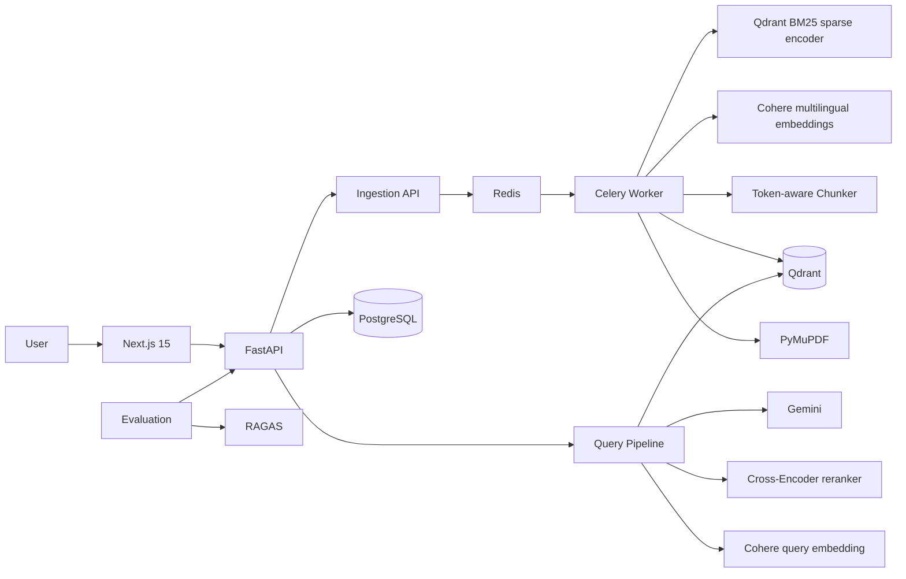

# Shodh Architecture

## System boundary

Shodh is split into four layers: ingestion, retrieval, generation, and product/evaluation surfaces.

## Ingestion flow

1. The API validates the PDF and writes it to the shared upload volume.
2. A Celery task is created with a stable job ID.
3. The worker extracts text page-by-page with PyMuPDF.
4. Each page is recursively split using a 512-token target and 128-token overlap. Pages are never mixed into the same chunk.
5. Cohere `embed-multilingual-v3.0` embeds document chunks in batches of 96.
6. Qdrant stores a named dense vector and a named BM25 sparse vector for every chunk.
7. The PostgreSQL document row transitions from `queued` → `processing` → `complete` or `failed`.

## Query flow

1. `langdetect` identifies the question language.
2. Cohere creates a multilingual search-query embedding.
3. Qdrant returns the top 20 dense and top 20 BM25 candidates.
4. Each candidate list is normalized independently, then fused with `alpha * dense + (1-alpha) * sparse`.
5. The fused top 20 are reranked with `cross-encoder/ms-marco-MiniLM-L-6-v2`.
6. The best four chunks become the LLM context.
7. Gemini receives a strict grounding prompt requiring page/chunk citations and the user's language.
8. The complete retrieval trace is stored in PostgreSQL.

## Design decisions

### Why page-scoped chunking?

A citation that crosses pages is harder to inspect and harder to explain. Keeping chunks page-scoped makes citations deterministic and makes the UI evidence cards useful.

### Why separate dense and sparse vectors?

Semantic embeddings are strong for paraphrases and cross-lingual matches. BM25 preserves exact terminology, names, identifiers, and rare phrases. Keeping both lets retrieval use the strengths of each representation.

### Why rerank after fusion?

The first retrieval stage optimizes recall. The cross-encoder then spends its more expensive relevance computation on a much smaller candidate set.

### Why store the trace?

Evaluation, debugging, and the chat history all need to know what evidence was actually considered. Reconstructing it after generation introduces ambiguity, so the trace is persisted with the answer.
